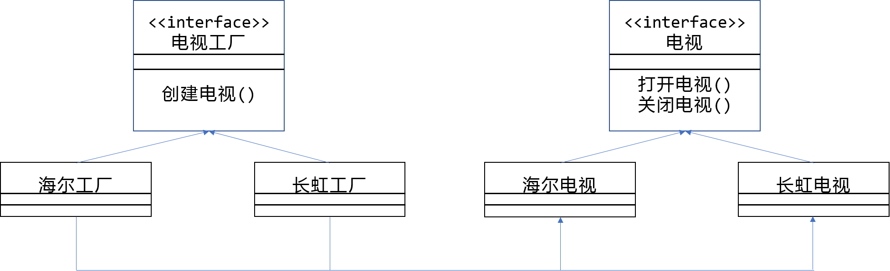

# Java 设计模式

## 一、设计模式

设计模式是一套被反复使用、多数人知晓的、经过分类编目的、代码设计经验的总结。
使用设计模式是为了可重用代码、让代码更容易被他人理解、保证代码可靠性。

### 代码规范
- 首先是要注意注释文档的格式，注释文档将用来生成 HTML 格式的代码报告，
所以注释文档必须书写在类、域、构造函数、方法、定义之前。
- 注释文档由两部分组成——描述、块标记。
- 注释的种类：文件头注释、构造函数注释、域注释、方法注释和定义注释。
文件头注释需要注明该文件的创建时间、文件名、命名空间信息。构造函数注释采用描述部分注明构造
函数的作用。
方法注释采用描述部分注明方法的功能，块标记注明方法的参数、返回值、异常等信息。

### 面向对象
> 面向对象OO = 面向对象的分析OOA + 面向对象的设计OOD + 面向对象的编程OOP

### 接口
接口好比一种模板，这种模板定义了对象必须实现的方法，其目的就是让这些方法可以作为接口实例被引用。
接口不能被实例化。类可以实现多个接口并且通过这些实现的接口被索引。
接口变量只能索引实现该接口的类的实例。

### 接口和抽象的区别
1. abstract class 在Java 语音中表示的是一种继承关系，一个类只能使用一次继承关系。
但是一个类却可以实现多个interface
2. abstract class 中可以有自己的数据成员，也可以有非abstract 的成员方法，而在
interface 中，只能够有静态的不能被修改的数据成员（也就是必须是static final 的，不过在
interface 中一般不定义数据成员），所有的成员方法都是abstract
3. Abstract class 和interface 所反映出的设计理念不同。其实abstract classs 表示的是"is---a"
关系，interface 表示的是“like---a”关系。
4. 实现抽象类和接口的类必须实现其中的所有方法。抽象类中可以有非抽象方法。接口中
则不能有实现方法。
5. 接口中定义的变量默认是public static final 型，且必须给其初值，所以实现类中不能重
新定义，也不能改变其值。
6. 抽象类中的变量默认是friendly 型，其值可以再子类中重新定义，也可以重新赋值。
7. 接口中的方法默认都是public,abstract 类型的。

### 接口和委托的区别
接口可以包含属性、索引、方法以及事件。但委托不能包含事件。

### 软件设计原则：
- 开闭原则(OCP) 
对扩展开放，对修改关闭
- 里氏代换原则(LSP) 
任何类出现的地方，子类一定可以出现
- 依赖倒转原则(DIP) 
尽量依赖于抽象，而不要依赖于具体
- 接口隔离原则(ISP) 
尽量小的单独的接口，而不要提供大的接口，使通信尽可能窄
- 合成复用原则(CARP) 
尽量采取合成和聚合的方式达到复用，而不要使用继承达到复用
- 迪米特法则 
一个软件的实体尽可能少的与其他实体发生作用

## 1.1 创建型模式

- AbstractFactory (抽象工厂) 
- FactoryMethod (工厂方法) 
- Singleton (单态模式) 
- Builder (建造者模式) 
- ProtoType (原型模式)

## 1.1.1 工厂方法
定义一个用于创建对象的接口，让子类决定实例化哪一个类。FactoryMethod
使一个类的实例化延迟到其子类。

### 适用性
1. 当一个类不知道它所必须创建的对象的类的时候。
2. 当一个类希望由它的子类来指定它所创建的对象的时候。
3. 当想将创建对象的职责委托给多个帮助子类中的某一个，并且希望将哪一
个帮助子类是代理者这一信息局部化的时候。

### 参与者
1. Product 
定义工厂方法所创建的对象的接口。
2. ConcreteProduct 
实现Product 接口。
3. Creator 
声明工厂方法，该方法返回一个Product 类型的对象 
Creator 也可以定义一个工厂方法的缺省实现，它返回一个缺省的
ConcreteProduct 对象。 
可以调用工厂方法以创建一个Product 对象。
4. ConcreteCreator 
重定义工厂方法以返回一个ConcreteProduct 实例。

### 类图

### 例子
#### product
<pre><code>
public interface Work {
    void doWork();
}
</code></pre>

#### ConcreteProduct

<pre><code>
public class StudentWork implements Work {
    public void doWork() {
        System.out.println("学生做作业!");
    }
}
public class TeacherWork implements Work {
    public void doWork() {
        System.out.println("老师审批作业!");
    }
}
</code></pre>

#### Creator
<pre><code>
public interface IWorkFactory {
    Work getWork();
}
</code></pre>

#### ConcreteCreator
<pre><code>
public class StudentWorkFactory implements IWorkFactory {
    public Work getWork() {
        return new StudentWork();
    }
}
public class TeacherWorkFactory implements IWorkFactory {
    public Work getWork() {
        return new TeacherWork();
    }
}
</code></pre>

#### Test
<pre><code>
public class Test {
    public static void main(String[] args) {
        IWorkFactory studentWorkFactory = new StudentWorkFactory();
        studentWorkFactory.getWork().doWork();
        IWorkFactory teacherWorkFactory = new TeacherWorkFactory();
        teacherWorkFactory.getWork().doWork();
    }
}
</code></pre>

#### result
> 学生做作业! 
> 老师审批作业!

